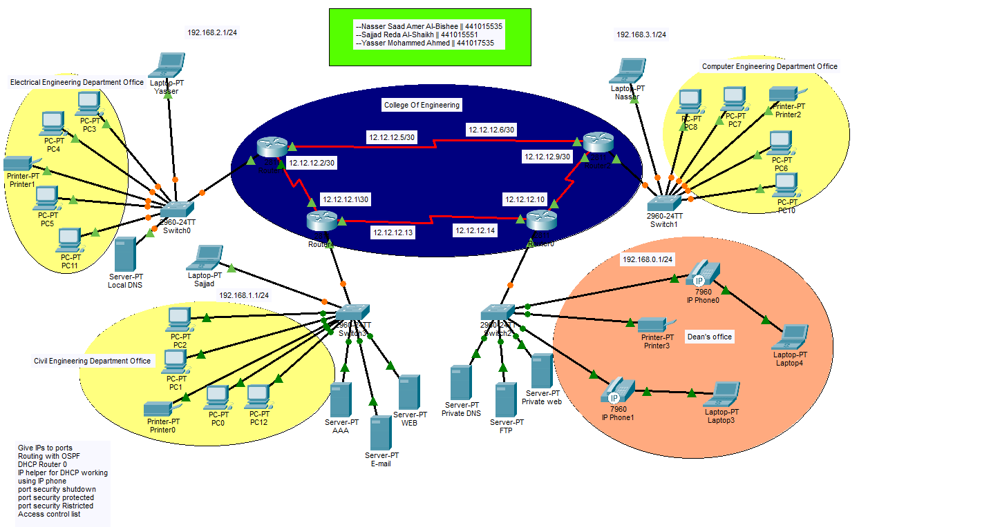

# Enterprise University Network Design

  

A secure enterprise campus network designed and implemented using Cisco Packet Tracer. The project simulates a multi-building university environment with enterprise routing, switching, security, and network services.

## Overview

This project demonstrates the design and implementation of a secure enterprise university network using Cisco Packet Tracer. The network simulates a real-world campus environment by connecting multiple university buildings through a resilient routing infrastructure while providing secure communication, centralized services, and controlled access to network resources.

The project was developed to apply enterprise networking concepts, including routing, switching, network security, authentication, and infrastructure services, following industry best practices.

## Technologies

Cisco Packet Tracer • OSPF • VLANs • DHCP • DNS • ACLs • AAA (RADIUS) • SSH • EtherChannel • Port Security • VoIP
