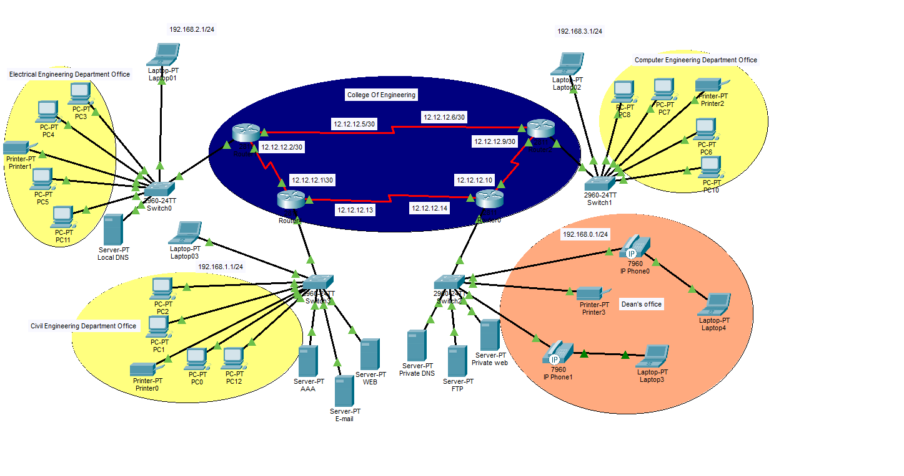

# Enterprise University Network Design

  

A secure enterprise campus network designed and implemented using Cisco Packet Tracer. The project simulates a multi-building university environment with enterprise routing, switching, security, and network services.

## Overview

This project demonstrates the design and implementation of a secure enterprise university network using Cisco Packet Tracer. The network simulates a real-world campus environment by connecting multiple university buildings through a resilient routing infrastructure while providing secure communication, centralized services, and controlled access to network resources.

The project was developed to apply enterprise networking concepts, including routing, switching, network security, authentication, and infrastructure services, following industry best practices.

## Key Features

- Designed a secure enterprise network connecting **4 university buildings**.
- Implemented dynamic routing using **OSPF**.
- Configured **VLAN segmentation** for different departments and administrative networks.
- Deployed core infrastructure services including **DHCP** and **DNS**.
- Secured network access using **ACLs**, **AAA (RADIUS)**, **SSH**, and **Port Security**.
- Configured **EtherChannel** to improve link redundancy and bandwidth.
- Integrated **VoIP/IP Phones** for administrative communication.
- Validated end-to-end connectivity, routing, authentication, and access control across the enterprise network.

## Network Architecture

The enterprise network was designed to simulate a real-world university campus consisting of **4 interconnected buildings**, each representing a different organizational unit.

The network architecture includes:

- Administrative network for the Dean's office.
- Department networks for academic staff.
- General user network for students and employees.
- Dedicated infrastructure servers providing centralized network services.
- VoIP infrastructure supporting IP Phones for administrative communication.

Each building is connected through a resilient routed backbone, while VLAN segmentation is used to isolate departments and improve security, scalability, and network management.

## Security Implementation

The network was designed with multiple security layers to simulate enterprise security practices.

Implemented security mechanisms include:

- **Access Control Lists (ACLs)** to restrict unauthorized network access.
- **AAA Authentication (RADIUS)** for centralized user authentication and authorization.
- **SSH** for secure remote device management.
- **Port Security** to prevent unauthorized devices from connecting to switch ports.
- **VLAN segmentation** to isolate departments and reduce broadcast domains.

## Network Services

The enterprise network provides centralized infrastructure services to support communication, authentication, and resource sharing across the university campus.

Implemented services include:

- **DHCP** for automatic IP address allocation.
- **DNS** for hostname resolution.
- **Web Server** for internal web services.
- **FTP Server** for secure file transfer.
- **Email Server** for organizational communication.
- **AAA (RADIUS) Server** for centralized authentication.

## Testing & Validation

The network was thoroughly tested to verify connectivity, routing, security policies, and service availability.

Validation activities included:

- Verified end-to-end connectivity between all university buildings.
- Confirmed dynamic route propagation using OSPF.
- Tested DHCP address assignment for client devices.
- Verified DNS name resolution.
- Validated SSH remote access to network devices.
- Confirmed ACL functionality by testing authorized and unauthorized traffic.
- Verified AAA (RADIUS) authentication for secure device access.
- Tested VoIP communication between IP Phones.

## Skills Demonstrated

This project demonstrates practical knowledge and hands-on experience in:

- Enterprise Network Design
- Cisco Routing & Switching
- OSPF Dynamic Routing
- VLAN Design & Segmentation
- Enterprise Network Security
- Access Control Lists (ACLs)
- AAA (RADIUS) Authentication
- SSH Secure Management
- DHCP & DNS Services
- EtherChannel Configuration
- VoIP Network Integration
- Network Troubleshooting
- Infrastructure Documentation
- Network Testing & Validation

## Future Improvements

Future enhancements planned for this project include:

- IPv6 implementation
- OSPF authentication
- Syslog integration
- Network Time Protocol (NTP)
- SNMP monitoring
- High Availability (HSRP)
- Firewall integration

## Technologies

Cisco Packet Tracer • OSPF • VLANs • DHCP • DNS • ACLs • AAA (RADIUS) • SSH • EtherChannel • Port Security • VoIP
